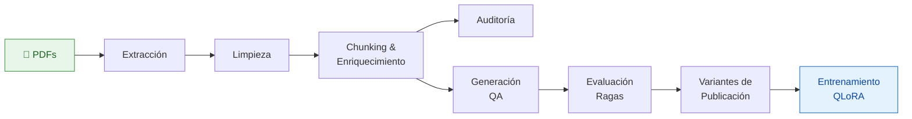

<div align="center">


# Fine-Tuning Benchmark

**Pipeline completo para generación de QA clínico en español y fine-tuning con QLoRA**

[](https://github.com/JhonHander/Fine-Tunning-Benchmark/stargazers)
[](https://github.com/JhonHander/Fine-Tunning-Benchmark/network)
[](https://github.com/JhonHander/Fine-Tunning-Benchmark/commits/main)
[](https://github.com/JhonHander/Fine-Tunning-Benchmark/issues)

[](https://python.org)
[](https://pytorch.org)
[](https://huggingface.co/docs/transformers)
[](https://huggingface.co/docs/peft)
[](https://huggingface.co/docs/trl)
[](https://github.com/TimDettmers/bitsandbytes)

[](https://huggingface.co/datasets/JhonHander/obstetrics-qa-synthetic-es)
[](https://huggingface.co/datasets/JhonHander)
[](./pdfs/obstetrics)
[](./docs/obstetrics_lm_pipeline.md)
[](./LICENSE)

[Instalación](#instalación) · [Entregables](#entregables) · [Pipeline](#pipeline) · [Resultados](#resultados) · [Fine-Tuning](#fine-tuning) · [Docs](./docs)

</div>

---

> [!IMPORTANT]
> Este pipeline procesa **PDFs clínicos en español** (obstetricia y ginecología) y los convierte en datasets de QA auditables para fine-tuning de LLMs con QLoRA. No es un preprocesador de MedQuAD/BioASQ — esos scripts legacy fueron reemplazados.

## Features

- **Extracción y limpieza de PDFs** — PyMuPDF con fallback de pdfplumber, detección de OCR, eliminación de encabezados/pies de página
- **Puntaje Clínico** — Heurística con 50+ términos clínicos en español/inglés para rankear relevancia de chunks
- **División a Nivel de Documento** — Cero fuga de datos: todos los chunks de un PDF quedan en un solo split
- **Generación Sintética de QA** — OpenAI Structured Outputs con 6 tipos de preguntas y 3 capas de control de calidad
- **Evaluación con Ragas** — Métricas formales de fidelidad y relevancia de respuestas
- **Fine-Tuning QLoRA** — TRL + PEFT + bitsandbytes, compatible con Gemma 4 y MedGemma
- **Procesamiento Incremental** — Agregá nuevos PDFs sin reprocesar todo el corpus

## Entregables

Este proyecto ofrece **dos productos de investigación independientes**. Elegí el que necesites:

### 1. Corpus Clínico Limpio (LM Dataset)

Para investigadores que prefieren **generar su propio QA** a partir del corpus.

- **2,223 chunks** de texto clínico en español, enriquecidos con metadatos
- Cada chunk incluye: `source_pdf`, `pages`, `section_type`, `content_role`, `clinical_score`, `topics` (18 tópicos), `token_estimate`
- Split 90/5/5 a nivel de documento — **cero fuga de datos**
- Disponible en `datasets/obstetrics/lm/`

[📥 Descargar del repo](./datasets/obstetrics/lm) · [🤗 Ver en Hugging Face](https://huggingface.co/datasets/JhonHander/obstetrics-lm-es)

### 2. Dataset Sintético de Q+A

Para quienes quieren **entrenar o evaluar modelos directamente**.

- **5,727 pares Q+A** generados con OpenAI GPT-5.2 (Structured Outputs)
- 6 tipos de preguntas: factual, definición, comparación, razonamiento, aplicación, hipotético
- Tres variantes de publicación:

| Variante | Formato | Uso recomendado |
|----------|---------|-----------------|
| `sft_closed_book` | Pregunta → Respuesta | Fine-tuning sin contexto. Mide internalización del dominio. |
| `sft_grounded` | Contexto + Pregunta → Respuesta | Fine-tuning con contexto. Mide QA basada en evidencia. |
| `qa_flat_jsonl` | Registro plano con metadatos | Auditoría, análisis, publicación científica. |

Disponible en `datasets/obstetrics/qa/publication/`

[📥 Descargar del repo](./datasets/obstetrics/qa/publication) · [🤗 Ver en Hugging Face](https://huggingface.co/datasets/JhonHander/obstetrics-qa-synthetic-es)

> [!NOTE]
> Los datasets se publican en **Hugging Face** (estándar de la comunidad NLP) para que puedas cargarlos con `datasets.load_dataset()`. El código y la metodología se mantienen en GitHub.

## Pipeline



| Paso | Script | Salida |
|:----:|--------|--------|
| 1 | `extract_pdfs.py` | `raw_pages.jsonl` + `inventory.json` |
| 2 | `clean_text.py` | `clean_pages.jsonl` + `cleaning_report.json` |
| 3 | `build_lm_dataset.py` | `train/val/test_lm.jsonl` + `chunks.jsonl` |
| 4 | `audit_dataset.py` | `audit_report.json` |
| 5 | `generate_synthetic_qa.py` | `raw.jsonl` + `sft.jsonl` |
| 6 | `evaluate_qa_with_ragas.py` | Reportes JSON de evaluación |
| 7 | `prepare_qa_publication_variants.py` | `sft_closed_book/`, `sft_grounded/`, `qa_flat_jsonl/` |
| 8 | `train_qlora_trl.py` | Checkpoint del adaptador QLoRA |

Orquestadores: `run_full_pipeline.py` (pasos 1–4) · `run_incremental.py` (solo PDFs nuevos)

## Resultados

### Estado del Corpus

| Métrica | Valor |
|---------|------:|
| PDFs procesados | 63 |
| Páginas extraídas | 5.856 |
| Páginas limpias (mantenidas) | 5.176 (88,4 %) |
| Páginas descartadas | 660 |
| Chunks generados (antes dedupe) | 2.273 |
| **Chunks finales** | **2.268** |
| Tokens promedio por chunk | 879 |
| Duplicados exactos eliminados | 1 |
| Near-duplicates eliminados | 2 |
| Fuga de datos entre splits | **0** |

**Razones de descarte de páginas:**

| Razón | Cantidad |
|-------|---------:|
| Requiere OCR (`needs_ocr`) | 332 |
| Demasiado corta (`too_short`) | 155 |
| Densa en referencias (`reference_heavy`) | 89 |
| Texto fragmentado (`fragmented_text`) | 56 |
| Índice o tabla de contenidos | 14 |
| Sección no clínica | 14 |

### Splits del Corpus (LM Dataset)

| Split | Chunks | PDFs Fuente | % del Corpus |
|:------|-------:|------------:|:------------|
| Entrenamiento | 1.997 | 54 | 88,0 % |
| Validación | 115 | 3 | 5,2 % |
| Test | 111 | 3 | 4,9 % |
| **Total** | **2.223** | **60** | **100 %** |

### Dataset Q+A Sintético

Generado con **GPT-5.2** (OpenAI Structured Outputs). Evaluado con **Ragas**.

| Split | Pares Q+A | Chunks Origen | PDFs Fuente |
|:------|----------:|--------------:|------------:|
| Entrenamiento | 5.093 | 1.744 | 52 |
| Validación | 306 | 101 | 2 |
| Test | 328 | 108 | 3 |
| **Total** | **5.727** | **1.953** | **57** |

**Grounding (solapamiento contexto-respuesta):** 0,6836 promedio. Solo 27 pares (0,54 %) con grounding bajo.

### Evaluación Ragas (Dataset Final)

Muestreo estratificado evaluado con métricas formales de fidelidad y relevancia.

| Split | Muestra Evaluada | Fidelidad (Faithfulness) | Relevancia (Relevancy) |
|:------|-----------------:|-------------------------:|-----------------------:|
| Entrenamiento | 300 / 5.093 | **0,7726** | **0,6466** |
| Validación | 100 / 306 | **0,7826** | **0,6812** |
| Test | 100 / 328 | **0,7132** | **0,5583** |

> [!NOTE]
> Las métricas Ragas son estimaciones conservadoras basadas en LLM-as-judge. La escala es continua [0, 1]. Valores > 0,7 en fidelidad indican alta consistencia entre respuesta y contexto fuente.

### Validación de Modelos Generadores (POC A/B/C/D)

Antes de la corrida final, se compararon 4 configuraciones generador-evaluador en muestras de 5 chunks:

| Experimento | Generador | Evaluador | Faithfulness | Relevancy | Aceptación |
|:-----------:|:---------:|:---------:|:------------:|:---------:|:----------:|
| **A** | GPT-5.4 | GPT-5.5 | 0,9876 | 0,9829 | 100 % |
| **B** | GPT-5.4-mini | GPT-5.5 | 0,9382 | 0,9447 | 94,1 % |
| **C** | GPT-5.2 | GPT-5.5 | 0,9924 | 0,9947 | 100 % |
| **D** | GPT-5.4 | GPT-5.4-mini | 0,9235 | 0,9359 | 94,1 % |

> [!TIP]
> El **experimento C** (GPT-5.2 + GPT-5.5) mostró la mayor calidad en POC. Sin embargo, la generación final usó **GPT-5.2 sin evaluador intermedio** por eficiencia de costos, confiando en las heurísticas de grounding y filtrado de contenido del pipeline.

### Distribución de Tipos de Pregunta (Dataset Final)

Basado en el experimento representativo (train split, muestra POC):

| Tipo | % Aprox. | Ejemplo |
|------|---------:|---------|
| `factual` | ~20 % | "¿Qué es la preeclampsia?" |
| `definicion` | ~12 % | "Defina síndrome de HELLP." |
| `comparacion` | ~12 % | "Diferencias entre cesárea urgente y electiva." |
| `razonamiento` | ~25 % | "¿Por qué se prefiere sulfato de magnesio...?" |
| `aplicacion` | ~25 % | "¿Cómo manejar la hemorragia postparto?" |
| `hipotetico` | ~6 % | "Si una paciente de 32 semanas presenta..." |

### Taxonomía Clínica (Cobertura por Split)

Los 18 tópicos están presentes en los 3 splits. Cobertura en train:

`fetal_monitoring` (1.116) · `newborn_care` (797) · `prenatal_care` (731) · `infection` (671) · `manual` (652) · `postpartum` (525) · `hemorrhage` (532) · `cesarean` (455) · `ultrasound` (431) · `preeclampsia` (372) · `vaginal_birth` (368) · `gynecologic_oncology` (479) · `labor_induction` (276) · `preterm_labor` (240) · `diabetes_gestational` (224) · `contraception` (183) · `infertility` (194) · `genetics` (166) · `menopause` (88)

## Instalación

```bash
git clone https://github.com/JhonHander/Fine-Tunning-Benchmark.git
cd Fine-Tunning-Benchmark
python -m venv .venv && source .venv/bin/activate
pip install -r requirements.txt
```

> [!NOTE]
> Necesitás `OPENAI_API_KEY` para generación de QA y `HF_TOKEN` para acceso a modelos.
> Copiá `.env.example` a `.env` y completá tus claves.

## Inicio Rápido

**Pipeline completo (extracción → auditoría):**

```bash
python scripts/run_full_pipeline.py
```

**Generar pares de QA:**

```bash
# Generar para cada split (ajustá las rutas según corresponda)
python scripts/generate_synthetic_qa.py \
  --input datasets/obstetrics/lm/train_lm.jsonl \
  --raw-output datasets/obstetrics/qa/final/train/raw.jsonl \
  --sft-output datasets/obstetrics/qa/final/train/sft.jsonl \
  --progress-file datasets/obstetrics/qa/final/train/progress.json \
  --report-output datasets/obstetrics/qa/final/train/generation_report.json \
  --model gpt-5.4-mini \
  --min-pairs 2 --max-pairs 5

# Repetir para validation y test cambiando las rutas de --input y --*-output
```

**Fine-tuning (smoke test):**

```bash
python scripts/train_qlora_trl.py \
  --model-name google/gemma-4-E2B-it \
  --dataset-variant sft_grounded \
  --output-dir outputs/smoke-test \
  --max-steps 10 \
  --train-limit 64 \
  --eval-limit 32
```

**Fine-tuning (corrida completa):**

```bash
python scripts/train_qlora_trl.py \
  --model-name google/gemma-4-E2B-it \
  --dataset-variant sft_closed_book \
  --output-dir outputs/gemma4-e2b-closed-book
```

## Fine-Tuning

Modelos soportados y variantes recomendadas:

| Modelo | Variante | Método | Propósito |
|--------|---------|--------|---------|
| Gemma 4 E2B IT | `sft_closed_book` | QLoRA | Adaptación al dominio sin contexto |
| Gemma 4 E2B IT | `sft_grounded` | QLoRA | QA basada en evidencia |
| MedGemma 1.5 4B IT | `sft_closed_book` | QLoRA | Adaptación de modelo médico |
| MedGemma 1.5 4B IT | `sft_grounded` | QLoRA | QA médica basada en evidencia |

> [!TIP]
> Para 16 GB de VRAM, empezá con **Gemma 4 E2B IT**. MedGemma requiere smoke test antes de corridas completas.

<details>
<summary><strong>Cargar Dataset con 🤗 Datasets</strong></summary>

```python
from datasets import load_dataset

dataset = load_dataset(
    "json",
    data_files={
        "train": "datasets/obstetrics/qa/publication/sft_grounded/train.jsonl",
        "validation": "datasets/obstetrics/qa/publication/sft_grounded/validation.jsonl",
        "test": "datasets/obstetrics/qa/publication/sft_grounded/test.jsonl",
    },
)

train = dataset["train"]           # 5.093 pares
eval_split = dataset["validation"] # 306 pares
# dataset["test"] → reservado solo para evaluación final
```

</details>

## Estructura del Proyecto

```
Fine-Tunning-Benchmark/
├── pdfs/obstetrics/              # 64 PDFs clínicos fuente
├── artifacts/obstetrics/
│   ├── corpus/                   # raw_pages · clean_pages · chunks
│   ├── metadata/                 # inventory · manifest
│   ├── reports/                  # cleaning · audit · build reports
│   ├── tables/                   # tablas estructuradas extraídas
│   └── qa_experiments/           # comparación de modelos (A/B/C/D)
├── datasets/obstetrics/
│   ├── lm/                       # train/val/test_lm.jsonl (2.223 chunks)
│   └── qa/
│       ├── final/                # raw + sft por split
│       └── publication/          # closed_book · grounded · flat
├── scripts/
│   ├── extract_pdfs.py           # Paso 1: Extracción de PDFs
│   ├── clean_text.py             # Paso 2: Limpieza de texto
│   ├── build_lm_dataset.py       # Paso 3: Chunking + enriquecimiento
│   ├── audit_dataset.py          # Paso 4: Reporte de auditoría
│   ├── generate_synthetic_qa.py  # Paso 5: Generación de QA (OpenAI)
│   ├── evaluate_qa_with_ragas.py # Paso 6: Evaluación Ragas
│   ├── prepare_qa_publication_variants.py  # Paso 7: Preparación para publicación
│   ├── train_qlora_trl.py        # Paso 8: Fine-tuning QLoRA
│   ├── run_full_pipeline.py      # Orquestador: rebuild completo
│   ├── run_incremental.py         # Orquestador: solo PDFs nuevos
│   └── utils.py                  # Utilidades compartidas (1.280 líneas)
├── docs/
│   ├── obstetrics_lm_pipeline.md
│   ├── qa_dataset_evaluation_workflow.md
│   ├── article_methodology.md
│   └── research_notes/
├── public/app-icon.png
└── requirements.txt
```

<details>
<summary><strong>Referencia CLI (todos los scripts)</strong></summary>

### `extract_pdfs.py`
```bash
python scripts/extract_pdfs.py [--pdf-dir pdfs/obstetrics] [--output-dir artifacts/obstetrics]
```

### `clean_text.py`
```bash
python scripts/clean_text.py [--input raw_pages.jsonl] [--manifest inventory.json]
```

### `build_lm_dataset.py`
```bash
python scripts/build_lm_dataset.py \
  --min-tokens 180 --max-tokens 1200 --overlap-tokens 80 \
  --min-clinical-score 5 --seed 42
```

### `audit_dataset.py`
```bash
python scripts/audit_dataset.py [--input-dir artifacts/obstetrics]
```

### `generate_synthetic_qa.py`
```bash
# Generar para cada split (ajustá las rutas según corresponda)
python scripts/generate_synthetic_qa.py \
  --input datasets/obstetrics/lm/train_lm.jsonl \
  --raw-output datasets/obstetrics/qa/final/train/raw.jsonl \
  --sft-output datasets/obstetrics/qa/final/train/sft.jsonl \
  --progress-file datasets/obstetrics/qa/final/train/progress.json \
  --report-output datasets/obstetrics/qa/final/train/generation_report.json \
  --model gpt-5.4-mini \
  --min-pairs 2 --max-pairs 5 \
  --enable-quality-eval \
  --concurrency 8

# Repetir para validation y test cambiando las rutas de --input y --*-output
```

### `evaluate_qa_with_ragas.py`
```bash
python scripts/evaluate_qa_with_ragas.py \
  --input sft.jsonl \
  --sample-size 200
```

### `train_qlora_trl.py`
```bash
python scripts/train_qlora_trl.py \
  --model-name google/gemma-4-E2B-it \
  --dataset-variant sft_grounded \
  --lora-r 16 --lora-alpha 32 \
  --max-steps 500 \
  --output-dir outputs/gemma4-grounded
```

</details>

## Control de Calidad

Tres capas aseguran la calidad del dataset:

1. **Heurísticas locales** — Filtrado por rol de contenido, umbral de puntaje clínico, deduplicación
2. **LLM como Juez** — Fidelidad, relevancia de respuesta, consistencia roundtrip por par QA
3. **Evaluación Ragas** — Métricas formales con muestreo estratificado por PDF fuente

## Taxonomía Clínica (18 Tópicos)

Cada chunk se etiqueta con tópicos clínicos relevantes:

`hemorrhage` · `preeclampsia` · `diabetes_gestational` · `preterm_labor` · `infection` · `cesarean` · `vaginal_birth` · `newborn_care` · `contraception` · `menopause` · `infertility` · `prenatal_care` · `postpartum` · `fetal_monitoring` · `labor_induction` · `gynecologic_oncology` · `ultrasound` · `genetics`

## Documentación

| Documento | Descripción |
|-----------|-------------|
| [Pipeline](./docs/obstetrics_lm_pipeline.md) | Walkthrough completo: extracción → auditoría |
| [Flujo de QA](./docs/qa_dataset_evaluation_workflow.md) | Generación y evaluación de QA |
| [Metodología](./docs/article_methodology.md) | Metodología del paper (español) |
| [README Dataset](./datasets/obstetrics/qa/publication/README.md) | Variantes de publicación y matriz de entrenamiento |
| [Notas de Investigación](./docs/research_notes/) | Estado, decisiones técnicas, plan de evaluación |

---

<div align="center">

**MinCiencias** · Ministerio de Ciencia, Tecnología e Innovación de Colombia

Construido con :heart: para NLP clínico en español

</div>